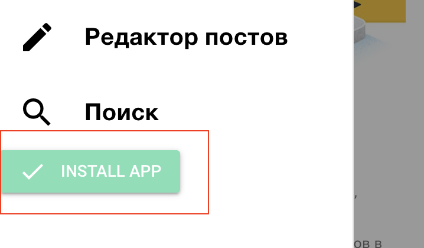

# [Psy Quasar App](https://quasar-psy.web.app/)

### Сделано при использовании:

-   Quasar v2 - Vue 3 framework,
-   Pinia - state manager,
-   Vite - builder,
-   Firestore (firebase) - noSQL database,
-   Firebase file storage

##

### Запуск сервера разработки

```bash
npm run dev:pwa
```

### Запуск сервера разработки под ios/android

```bash
quasar dev -m capacitor -T [android|ios]
```

##

### [Билды под мак, винду и собранный sdk](https://disk.yandex.ru/d/-OevZjBf7eV4AQ)

## На этом проекте реализовано:

:white_check_mark: [Настроен автодеплой ветки main на хостинг Firebase](https://quasar-psy.web.app/)

:white_check_mark: SSR (Server Side Rendering) - реализованно в ветке "ssr"

:white_check_mark: PWA (Progressive Web Application):

-   Кэширование App Shell (кроме коллекции постов).
-   Добавлена кнопка установки приложения.

    

:white_check_mark: Aвтосинхронизация данных firebase между устройствами

:white_check_mark: Возможность создания постов в offline
